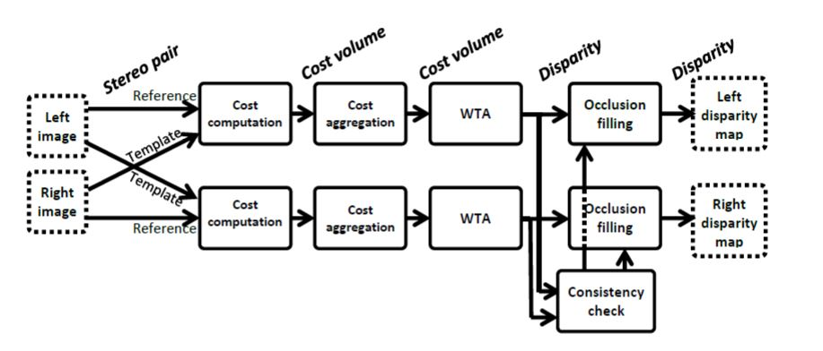
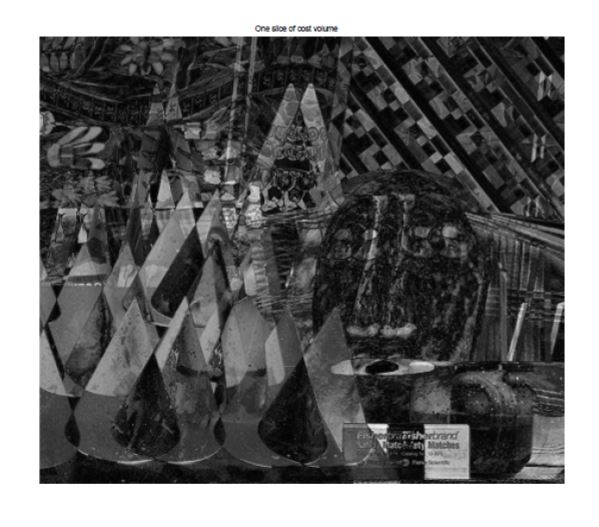
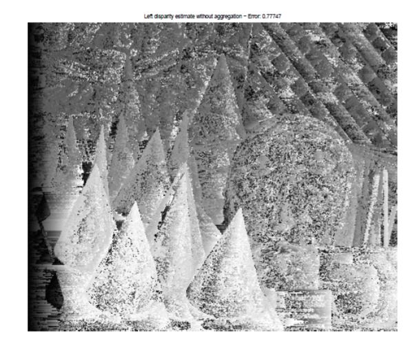
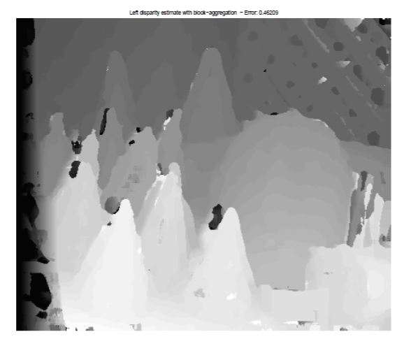
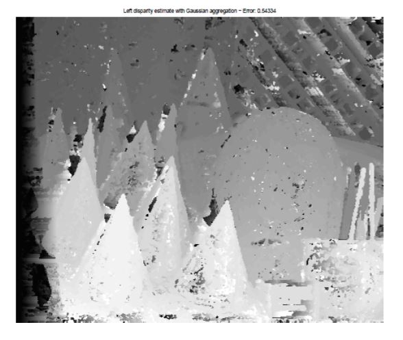
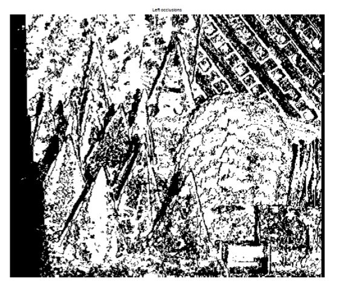
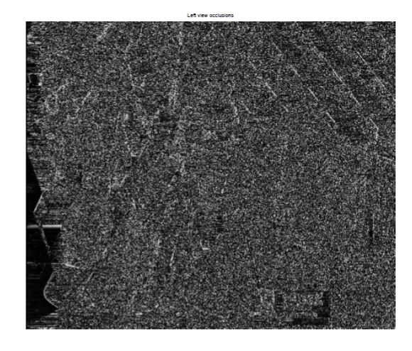
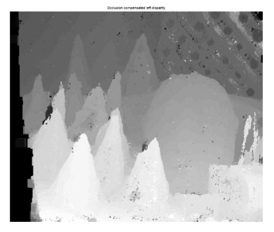
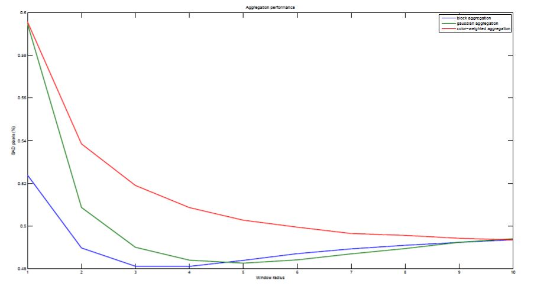
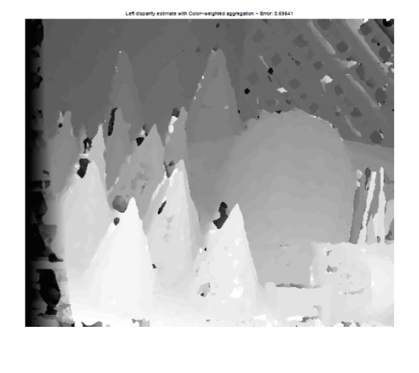

# stereo-matching
Dense disparity estimation via local stereo matching

## Overview
The code implements the local color-weighted disparity estimation algorithm and evaluates its performance on a set of stereo image pairs. The algorithm includes the following steps:

1. Cost function calculation
2. Cost aggregation based on:
    1. Box filtering 
    2. Gaussian filtering
    3. Local color-weighted filtering
3. Winner-takes-all (WTA) disparity estimation
4. Detection of occlusions
5. Computation confidence values for disparity estimates
6. Post-filtering to tackle occlusions and bad pixels (needs map from 4. and 5.)

## Performance Evaluation of the algorithm
- Calculation of BAD quality metric given the true disparity map
- Comparison of the performance of block matching and Gaussian smoothing for different sizes of aggregation windows
- Comparison of local color-weighted filtering against the two others above
- Visual assessment of the effect of occlusion filling

## Results:
- One slice of cost volume

- Left disparity estimation without aggregation

- Left disparity estimation with block aggregation

- Left disparity estimation with gaussian aggregation

- Comparison of block and gaussian filtering

- Left and right disparity estimation with gaussian aggregation

- Left occlusion map

- Left confidence map

- Left compansated (filled) occlusion map

- Comparison of color-weighted aggregation and the others

- Left disparity estimation with color-weighted aggregation

